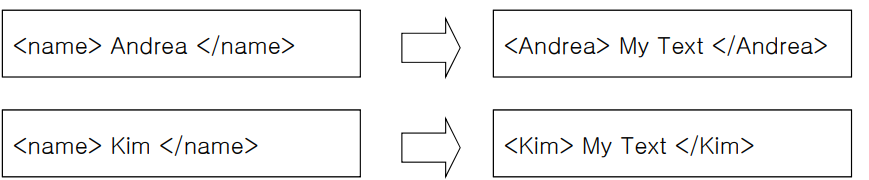

# Chapter 06 - XML Translation_XSLT

## 1. XSLT란?
**eXtensible Stylesheet Language Transformation**
**XML 문서를 다른 문법(HTML, XML 등의 MarkupLanguage)에 따르는 문서로 변환시키는 기술**
* XSL (또는 XSLT) 파일의 확장자 : .xsl
* XSLT 실행
  * IE를 이용
  * IE애서의 실행이 원할하지 않다면, http://xslttest.appspot.com/ 이곳을 사용

## 2. XSLT 문서 작성과 지정
### 2.1. XSLT 문서 작성
~~~xml
<?xml version="1.0" encoding="UTF-8"?>
<xsl:stylesheet xmlns:xsl="http://www.w3.org/1999/XSL/Transform" version="1.0">
 <!-- Do Something-->
</xsl:stylesheet>
~~~
### 2.2. XML 문서에서 XSLT 지정
~~~xml
<?xml version="1.0" encoding="UTF-8"?>
<?xml-stylesheet type="text/xsl" href="ex6-1.xsl" ?>
~~~

### 2.3. 표준
** XSLT에서는 `<xml:stylesheet>`로, XML 문서에서는  `<xml-stylesheet>`로 쓰는것이 표준

## 3.XSLT 문서 구조
* xsl:stylesheet는 일반적으로 복수개의 template으로 구성
* **순서대로 동작하지 않음에 유의**
* xsl:template match 해당하는/맞는 요소 등을 찾아서 실행
* xslt를 통해 xml 문서를 html 형태로 변환하여 출력이 가능
* 이 때 match로 찾는 부분을 문자열로 반환
### 3.1.1. 예시
~~~xml
<?xml version="1.0" encoding="UTF-8"?>
<xsl:stylesheet xmlns:xsl="http://www.w3.org/1999/XSL/Transform" version="1.0">
    <xsl:template match="...">
        <!-- Match에 맞는 요소들을 찾은 후 문장을 출력-->
    </xsl:template>
</xsl:stylesheet>
~~~
---
### 3.1.2 XSLT 맛보기 
생략
---
## EX 6-1 생략
---

## 4. Template선언 '\<xsl:template\>'
~~~xml
<?xml version="1.0" encoding="UTF-8"?>
<xsl:stylesheet xmlns:xsl="http://www.w3.org/1999/XSL/Transform" version="1.0">
    <xsl:template match="Xpath-Pattern" ... >
        <!-- Match에 맞는 요소들을 찾은 후 문장을 출력-->
    </xsl:template>
</xsl:stylesheet>
~~~
* Match에 지정된 element나 attribute 찾음
  * **찾아야 할 경로를 Xpath형태로 지정**
* Target이 찾아지면 출력문장을 변환결과로 출력
* 출력문장은 XML의 well-formed 규칙을 만족하는 문장들(html, xml,…)과 XSLT 지정 문장들로 구성
* ‘…’ (다른 속성)
  * mode="mode이름" priority="number" name="이름
---
## EX6-2
  * 적용 순서
    * 조금더 정확하게 지정된 template을 적용
      * "/" 보다는 "/node"가 더 정확한 지정
      * Xpath wild character에 들어간 것보다 **정확히 명칭**이 들어간 것!
    * 우선순위가 있을 경우 우선 순위가 더 큰 template을 적용
    * 가장 나중에 오는 template **즉, 코드 상 마지막에 오는것**을 적용
---
## 5. XPath Pattern
* Xpath로 매치가 되는 것이 **여러 개인 경우가 많다.**

### 5.1. 기본 XPath 패턴
* **'/' : XML 문서의 root**
  * 루트 요소가 아니라 문서의 루트임에 유의
  * '/'가 있으면 절대 위치, 없으면 상대 위치
* '/rootElementName' : XML 문서의 root 요소
* '/name1/name2' : XML 문서의 root요소인 name1의 하위요소 name2
* **'*'** : 모든 요소들을 지정하는 wild character
* '.' : 현재 요소
* '..' : 부모 요소
  *  EX : "../name1" : 현재 요소의 부모요소 밑의 name1 요소
     *  한 마디로 **형제 관계**
* '//name1' : XML 문서 전체에서 **레벨과 무관하게** 모든 name1 요소를 지정
  * EX : '핸드폰//가격' : '핸드폰' 요소 밑의 모든 '가격'요소들 지정. 
* '핸드폰/(모델명 | 통신사)' : 현재 요소 밑에 존재하는 '핸드폰' 요소의 하위요소들 중 **'모델명' 또는 '통신사'** 요소들 지정
  * '|' : or 
* '가격/@단위' : 현재 요소 밑에 존재하는 '가격'요소의 단위 attribute 지정
  * '@' : **attribute** 지정시 사용
* '/|*|@*' : Document Root, 모든 요소들이나, 모든 attribute 지정 

## 5.2. 조건 XpathPattern
**요소를 먼저 찾고, '조건식'을 만족하는 **요소명**을 찾음.**
* 기본 : **'요소명[조건식]'**
  * 핸드폰[색상]’ : ‘색상’ 요소를 가지는 모든 ‘핸드폰’ 요소들 지정
  * ‘할부구입[@여부]’ : 현재 요소의 하위 요소들 중 ‘여부’ attribute를 가지는 ‘할부구입’ 요소를 지정
  * **‘핸드폰[모델명="ANYCALL"]’** : 자식 요소인 ‘모델명’ 요소 값이 "ANYCALL" 인 ‘핸드폰’ 요소 지정
  * ‘핸드폰[가격/현금일시불 &lt; 100000]’ : 자식의 자식요소인 ‘현금일시불’ 요소 값이 100000 보다 더 작은 ‘핸드폰’ 요소 지정
  * ‘핸드폰[4]’ : 현재 요소의 하위요소인 ‘핸드폰’ 요소들 중 5번째 ‘핸드폰’ 요소 지정 (zero-based)
  * ‘핸드폰[index() &lt; 3]’ : ‘핸드폰’ 요소들 중 처음에 오는 **3개**의 ‘핸드폰’ 요소들 지정
  * ‘핸드폰[last()]’ : 마지막 ‘핸드폰’ 요소 지정

* 정리
  * 조건식을 주지 않고 쓰면, 하위 요소 중 **존재여부가 조건**
  * 비교연산자 및 논리 연산자
    * \&lt; : '<'에 해당
    * \&gt; : '>'에 해당
    * | : or
    * & : and

                    
## 6. Template 적용 \<xsl:apply-templates>
~~~xml
<xsl:apply-templates select="XPath pattern" mode="mode이름" />
~~~
* 템플릿을 찾아서 **적용**하라는 의미
* template 안에서 사용되며, 다른 template을 호출할 때 이용
  * 선택된 요소들은 해당 요소에 맞는 template이 적용
  * Mode는 지정된 mode값을 가지는 template을 호출
    * mode는 디버깅할 때 사용하기도 한다.
  
### 6.1. 예시코드1
~~~xml
<xsl:template match="order">
    <requisition>
        <xsl:apply-templates/>
    </requistion>
</xsl:template>
~~~
* 이 코드에서 현재위치는 order. requisition 부분이 출력으로 나옴
* 위 코드처럼 select가 없을 경우 **현재 위치의 자식 노드들**에 대해서 템플릿이 적용됨

### 6.2. 예시코드2
~~~xml
<xsl:template match="order">
    <requisition>
        <xsl:apply-templates select="item"/>
    </requistion>
</xsl:template>
~~~
* 이 코드에서 현재위치는 order. requisition 부분이 출력으로 나옴
* **select된 item**에 대해서 적용됨

## EX 6-3 생략

## 7. 노드값 \<xsl:value-of>
~~~xml
<xsl:value-of select="XPath pattern">
~~~
* 지정된 요소 및 속성의 값을 현재 위치에 출력
  * EX1 
    ~~~xml
    <xsl:value-of select="customer/@id"/>
    ~~~
    현재 노드의 하위요소인 customer의 id 속성 값을 출력
  * EX2 
    ~~~xml
    <xsl:value-of select="."/>
    ~~~
    현재 노드의 내용을 출력

## EX 6-4 생략

## 8. 변환설정 \<xsl:output>
~~~xml
<?xml version="1.0"?>
<xsl:stylesheet xmlns:xsl="http://www.w3.org/1999/XSL/Transform" version="1.0">
    <xsl:output method="xml or html or text"
                version="version"
                encoding="encoding"
                omit-xml-declaration="yes or no"
                standalone="yes or no"
                cdata-section-elements="CDATA sections"
                indent="yes or no" /> 
    …
</xsl:stylesheet>
~~~ 
* Method : 출력물 유형 결정. **XML/HTML/일반Text**
* Version, standalone은 출력유형이 **XML**일 경우에만 유효

## 9. Numbering \<xsl:number>
~~~xml
    <xsl:number format="형태"/>
~~~
* 현재 요소가 template에 match된 순서를 출력
* 형태:
    * "1" : 1, 2, 3, …
  * "01": 01, 02, 03, …
  * "a": a, b, c, …
  * "A": A, B, C, …
  * "i": i, ii, iii, iv, v, …
  * "I": I, II, III, IV, V, …
## 9.1. 사용 예시
~~~xml
    <xsl:number format="1"/>
    <xsl:number value="position()" format="I"/>
    <xsl:value-of select="position()" />
~~~

## 10. Sorting \<xsl:sort>
~~~xml
    <xsl:sort order="order" select="target" data-type="dtype"/>
~~~
* order
  * ascending : 오름차순
  * descending : 내림차순
* target : 정렬기준
  * 여러 개의 정렬 기준을 두기 위해서는 `<xsl:sort>` 여러번 작성
* dtype : 정렬 값의 자료형 지정. 주로 **"text"**
  * data-type = "number" : 정렬값을 **숫자**로 인식하고 비교
  * 특히, 가격처럼 자릿수가 다른 숫자를 비교할 때 주의
### 10.1 사용예시
~~~xml 
<xsl:apply-templates select = "/제품/핸드폰">
    <xsl:sort order="ascending" select="//가격" data-type="number"/>
    <!-- 주의-->
    <!--<xsl:sort order="ascending" select="//가격" data-type="number"/>-->
<xsl:apply-templates select>
~~~

## EX6-5
* 이 예제를 바로 실행하면 가격 순으로 정렬 되는 것이 아닌, template에서 선택된 순서가 나온다
~~~xml
    <xsl:number format="1"/>
    <xsl:number value="position()" format="I"/>
    <xsl:value-of select="position()" />
~~~
* 정렬 이후의 순서 즉, 가격 순서대로 번호를 붙이고 싶다면 위의 코드를 사용한다

## 11. XPath 함수
* count(노드집합) : 노드집합내에 있는 노드 개수 --> 매칭되는 개수
* sum(노드집합) : 노드집합내에 있는 모든 노드들의 합
* number(수식) : 수식을 숫자 값으로 변환
* format-number : 패턴에 따라서 출력 해주는 것
  * `<xsl:value-of select="format-number(가격,’###,###,##0’)" />`
    * #는 해당 자리에 숫자가 있을 때만 찍는 반면, 0은 값이 없을 경우 0으로 채움
* name : 현재 노드 이름. namespace **포함**
* local-name : 현재 노드 이름. namespace **비포함**
* text : 현재 노드 텍스트만 출력(**자식 노드의 텍스트 포함 X**)

## 12. 조건문 \<xsl:if>, \<xsl:choose>
### 12.1 \<xsl:if>
~~~ xml
<xsl:if test="Boolean Expression">
     …
</xsl:if>
~~~
* test 속성으로 조건문을 작성(Boolean 식)
* 조건을 정하지 않고, 이름만 쓴다면 **현재 노드의 하위노드로 특정 노드가 존재할 경우 True, 아니면 False**
  * ~~~ xml
    <xsl:if test="name">
     이름요소가 있습니다
    </xsl:if>
    ~~~

### 12.2 \<xsl:choose>
~~~xml 
<xsl:choose>
    <xsl:when test="…"> … </xsl:when>
    <xsl:when test="…"> … </xsl:when>
    <xsl:when test="…"> … </xsl:when>
    <xsl:otherwise> … </xsl:otherwise>
</xsl:choose>
~~~
* 다른 프로그래밍 언어의 switch와 비슷
* 예시
~~~xml
<xsl:choose>
    <xsl:when test="salary[number(.) &gt; 2000]"> A big number </xsl:when>
    <xsl:when test="salary[number(.) &gt; 1000]"> A medium number </xsl:when>
    <xsl:otherwise> A small number </xsl:otherwise>
</xsl:choose>
~~~

## 13. 반복문 \<xsl:for-each>
* apply-templates를 사용하면, 매번 반복 시 외부에 또 선언을 해주어야 하지만
* for-each의 경우 내부 template을 반복할 수 있다.
~~~xml
<xsl:for-each select="XPath Pattern">
    내부 template
</xsl:for-each>
~~~

### 13.1. 예제 코드

~~~ xml
<!-- XML -->
<names>
    <name>
        <first> 춘향 </first>
        <last> 성 </last>
    </name>
    <name>
        <first> 길동 </first>
        <last> 홍 </last>
    </name>
</names>
~~~

~~~ xml
<!-- XSLT-->
<xsl:template match="names">
    <xsl:for-each select="name">
        
 <xsl:value-of select="first"/> 

    </xsl:for-each>
</xsl:template>
~~~

~~~html
<!-- HTML 결과 -->

 춘향 

 길동 

~~~
---

## 14. Element 생성 \<xsl:element>
~~~xml
<xsl:element name="요소이름"
            use-attribute-sets="attribute이름들"
            namespace="namespace URI" >
…
</xsl:element>
~~~
* 동적으로 elemnt를 생성

### 14.1. 예시코드 1
~~~ xml
<!--XSLT-->
<xsl:element name = "blah"> My Text</xsl:element>
~~~
~~~ xml
<!-- 결과 XML-->
<blah> My Text</blah>
~~~

### 14.2. 예시코드 2
* Content를 Element로 바꾸는 코드
~~~xml
<xsl:template match="name">
    <xsl:element name="{.}"> My text </xsl:element>
</xsl:template>
~~~
*   결과 : 
* 여기서 '{.}'은 **현재 노드의 Value**를 의미
  * 매치가 일어난 name의 value를 이름으로 하는 element를 생성

## 15. Attribute 생성
### 15.1. \<xsl:attribute>
~~~ xml
<xsl:attribute name="name" namespace ="URI"> value </xsl:attribute>
~~~
### 15.1.1. 예시코드
~~~ xml
<!--XSLT-->
<name>
    <xsl:attribute name="id"> 123 </xsl:attribute>
    철수
</name>
~~~
~~~ xml
<!--Result XML-->
<name id = "123">철수</name>
~~~

### 15.2. \<xsl:attribute-set>
* element, attribute 뿐만 아니라 동적으로 element-attribute set도 생성
~~~ xml
<!-- XSLT-->
<xsl:attribute-set name="IdSize">
    <xsl:attribute name="id"> A-123 </xsl:attribute>
    <xsl:attribute name="size"> 123 </xsl:attribute>
</xsl:attribute-set>
 …
<xsl:element name="order" use-attribute-sets="IdSize" />
~~~

~~~xml
<!-- Result XML-->
<order id="A-213" size="123"/>
~~~

## 16. 복사하기 \<xsl:copy-of>
~~~xml
<xsl:copy-of select="Xpath expression"/>
~~~

* Xpath에 있는걸 그대로 복사
* \<xsl:copy-of>는 현재 노드의 **자식요소나 속성은 복사되지 않는다**
* **현재 노드의 값만 복사**
* copy-of와 value-of는 약간 다름

* 현재 위치에 지정된 노드를 그대로 출력
### 16.1. 예시코드
~~~xml
<xsl:choose>
    <xsl:otherwise> 
        <xsl:copy-of select="." /> 
    </xsl:otherwise>
</xsl:choose>
~~~
